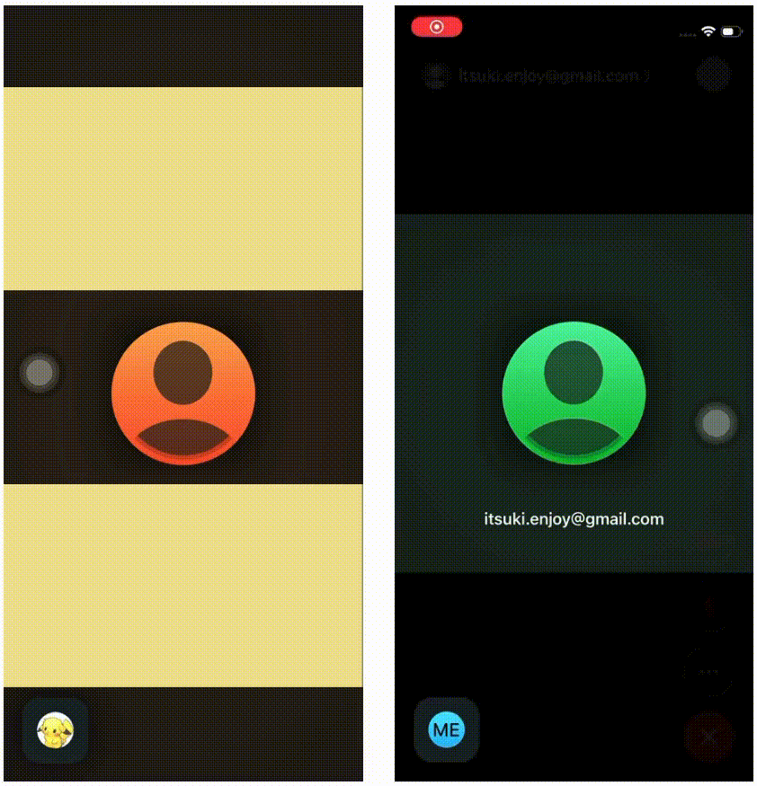

# SwiftUI: Group Activity For Coordinated Media Playback

A demo of using group activity framework to support Coordinated Media Playback.

To test the app, 
1. Prepare couple real devices that are signed into different apple accounts
2. Start a FaceTime Call between those devices 
3. Open the app and choose a video to play. 

For more details, please refer to my article [SwiftUI: Group Activity for REMOTE Synchronized Media Playback](https://medium.com/@itsuki.enjoy/swiftui-group-activity-for-remote-synchronized-media-playback-5fb67d282a52)

